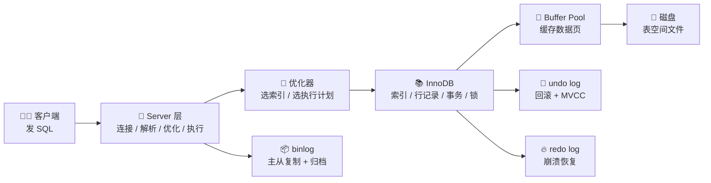
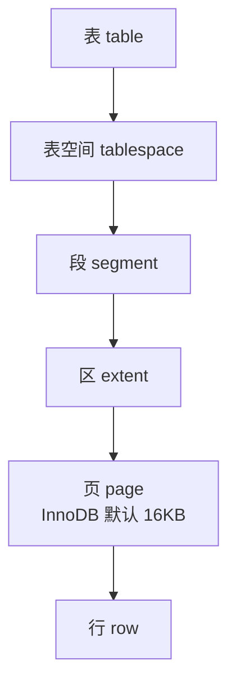
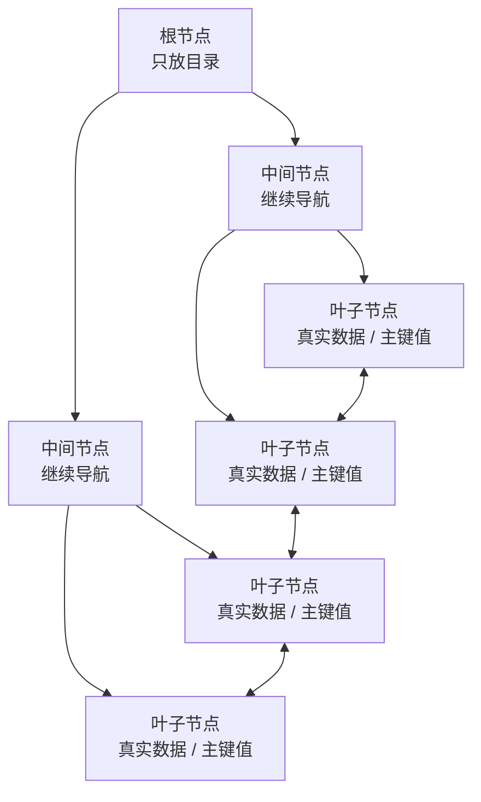
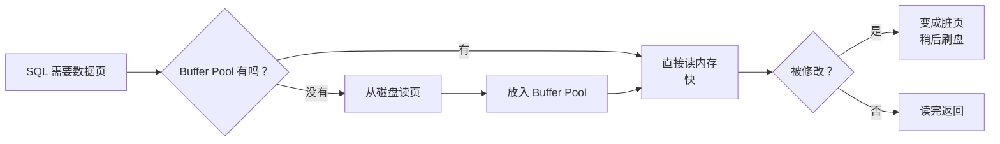
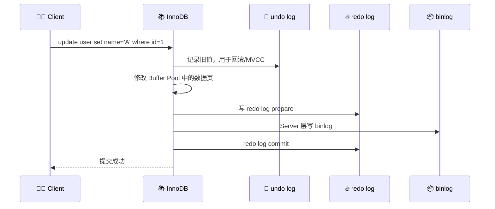
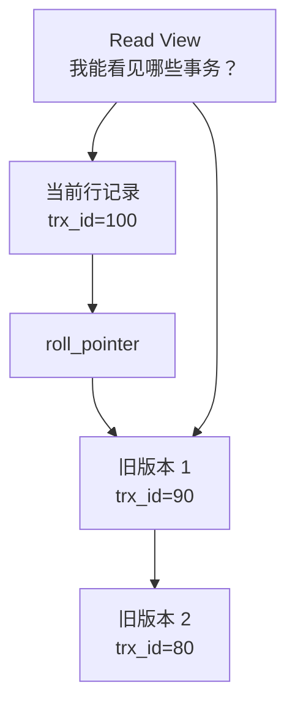
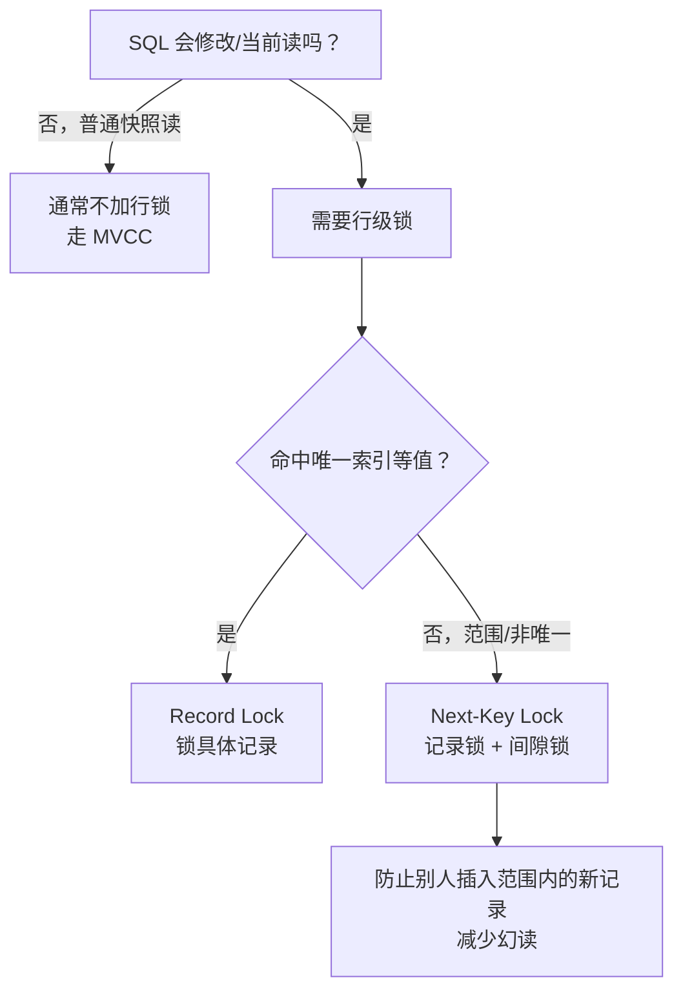
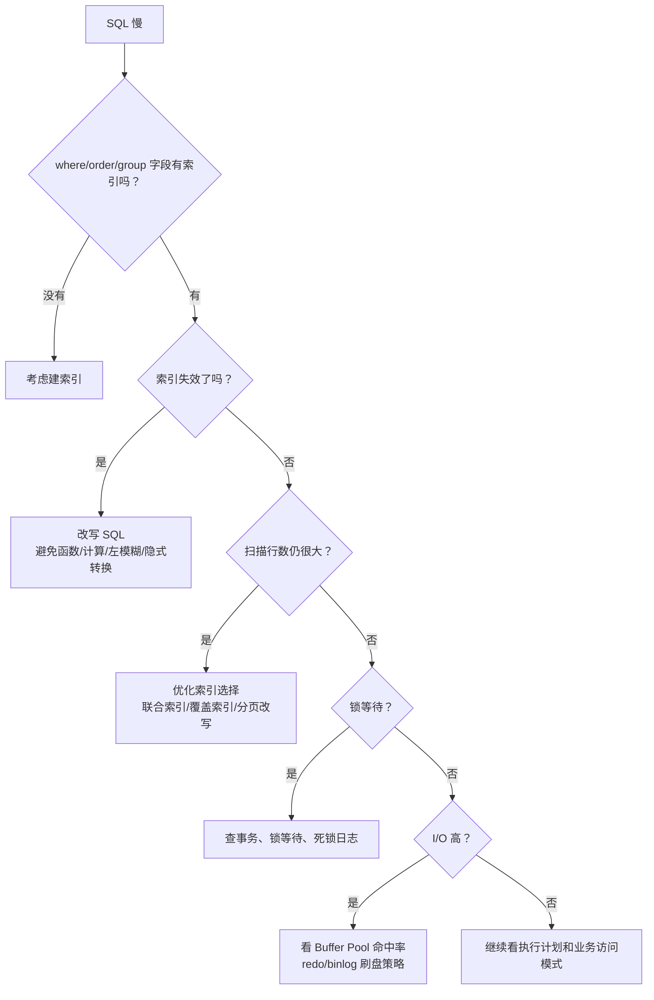

# MySQL 速通漫画版：一条 SQL 的奇妙冒险

> 基于本目录《图解 MySQL》内容整理。目标：10 分钟建立 MySQL 核心地图，知道查询、索引、事务、锁、日志、Buffer Pool 分别在干什么。

## 0. 先看全景图



一句话：

> Server 层负责“听懂 SQL、选计划”；InnoDB 负责“存数据、走索引、控事务、加锁、写日志”。

---

## 1. 漫画分镜：SELECT 是怎么跑的？

```text
┌───────────────────────┐
│ 🧑‍💻：select * from user │
│      where id = 10;    │
└───────────┬───────────┘
            ↓
┌───────────────────────┐
│ 🚪 连接器：你是谁？权限够吗？ │
└───────────┬───────────┘
            ↓
┌───────────────────────┐
│ 🧩 解析器：SQL 语法对不对？  │
└───────────┬───────────┘
            ↓
┌───────────────────────┐
│ 🧠 优化器：走哪个索引最划算？│
└───────────┬───────────┘
            ↓
┌───────────────────────┐
│ 🏃 执行器：找 InnoDB 拿数据 │
└───────────┬───────────┘
            ↓
┌───────────────────────┐
│ 📚 InnoDB：查 B+ 树 / 数据页 │
└───────────────────────┘
```

### 分析

- 解析器只判断“你说的是不是 SQL”。
- 优化器决定“怎么查更快”，比如走主键索引还是普通索引。
- 执行器真正调用存储引擎接口拿数据。
- MySQL 8.0 已移除查询缓存，所以别再把性能希望押在查询缓存上。

---

## 2. 数据到底放在哪里？



可以把 InnoDB 想成一个图书馆：

```text
📚 表空间 = 整栋图书馆
📦 页     = 一页书架，默认 16KB
🧾 行记录 = 书架上的一张卡片
```

### 行记录里有什么？


### 分析

- InnoDB 不是一行一行直接读磁盘，而是以“页”为单位读写。
- Buffer Pool 缓存的核心也是“页”。
- `trx_id` 和 `roll_pointer` 是 MVCC 的关键伏笔：它们让旧版本数据可以被找到。

---

## 3. 为什么索引用 B+ 树？



漫画理解：

```text
🧑‍💻：我要 id=100 的数据！
🌳 B+树：先看目录页 → 再看子目录 → 最后到叶子页。
🧑‍💻：我要 id 100 到 200？
🌳 B+树：叶子节点有链表，顺着扫就行。
```

### 分析

B+ 树适合 MySQL，主要因为：

- 树高低，磁盘 I/O 少；
- 叶子节点有序，范围查询舒服；
- 非叶子节点只做导航，一个页能放更多目录项；
- 和 InnoDB “页”的读写模型天然契合。

### 索引失效小抄

| 写法 | 为什么容易失效 |
|---|---|
| `like '%abc'` | 左边不确定，B+ 树无法从前缀定位 |
| `where age + 1 = 20` | 对索引列做计算 |
| `where lower(name) = 'tom'` | 对索引列用函数 |
| 联合索引跳过最左列 | 不满足最左匹配原则 |
| 字符串列用数字比较 | 可能发生隐式类型转换 |
| `or` 两边不是都有索引 | 优化器可能放弃索引 |

记忆法：

> 不要把索引列“加工变形”；B+ 树只认识原本有序的样子。

---

## 4. Buffer Pool：MySQL 的“热数据客厅”



漫画理解：

```text
🐬 MySQL：磁盘太远，我先把常用页搬到客厅。
🧑‍💻：那改数据呢？
🐬 MySQL：先改客厅里的页，标成“脏页”，之后再刷回磁盘。
```

### 分析

- Buffer Pool 缓存数据页、索引页、undo 页等。
- 修改数据时，通常先改内存页，不是每次都立刻写磁盘。
- 为了防止断电丢数据，需要 redo log 兜底。

---

## 5. UPDATE 背后的三本账：undo、redo、binlog



### 三种日志怎么分工？

| 日志 | 谁写 | 主要作用 | 像什么 |
|---|---|---|---|
| undo log | InnoDB | 回滚、MVCC 读旧版本 | 橡皮擦 |
| redo log | InnoDB | 崩溃恢复，保证已提交事务不丢 | 保险箱 |
| binlog | Server 层 | 主从复制、数据归档、恢复 | 录像带 |

### 为什么要两阶段提交？


分析：

- redo log 保证 InnoDB 自己能恢复。
- binlog 保证复制和归档一致。
- 两阶段提交是为了让 redo log 和 binlog 对同一个事务达成一致：要么都算成功，要么都能判断怎么恢复。

---

## 6. 事务隔离：MVCC 像“时间相册”



漫画理解：

```text
🧑‍💻 事务A：我开始读的时候，世界长这样。
📸 Read View：好，我给你拍张快照。
🧑‍💻 事务B：我后来改了数据。
🧑‍💻 事务A：没关系，我按快照找旧版本。
```

### 分析

- MVCC 通过 Read View + undo log 版本链实现。
- 可重复读下，同一个事务多次快照读，看到的结果通常一致。
- 普通 `select` 多数是快照读；`select ... for update` 是当前读，会加锁。

---

## 7. 锁：别让两个人同时改同一张卡片



### 常见锁

| 锁 | 锁什么 | 典型用途 |
|---|---|---|
| 全局锁 | 整个实例 | 全库逻辑备份 |
| 表锁 | 整张表 | 粗粒度控制 |
| MDL | 表结构元数据 | 防止读写时表结构被改 |
| Record Lock | 一条索引记录 | 锁中具体行 |
| Gap Lock | 两条记录之间的间隙 | 防止插入幻影记录 |
| Next-Key Lock | 记录 + 间隙 | 范围查询常见 |

### 分析

- InnoDB 的行锁本质上是加在“索引”上的。
- 查询条件没走索引，可能扫描更多记录，锁范围也会变大。
- 死锁不是“数据库坏了”，而是两个事务互相等锁；工程上要短事务、固定访问顺序、及时重试。

---

## 8. 一张排障地图：慢 SQL 先看哪里？



---

## 9. 最后用 6 句话收束

1. SQL 先经过 Server 层，再交给 InnoDB。
2. InnoDB 以页为单位读写，Buffer Pool 用来缓存页。
3. B+ 树索引的核心优势是：低树高、少 I/O、范围查询强。
4. 事务隔离靠 MVCC，MVCC 靠 Read View 和 undo log 版本链。
5. 修改数据靠 redo log 防崩溃，靠 binlog 做复制和归档。
6. 锁要结合索引理解：索引走得好，锁通常也更精准。

## 继续深入

- [执行一条 SQL 查询语句，期间发生了什么？](./base/how_select.md)
- [为什么 MySQL 采用 B+ 树作为索引？](./index/why_index_chose_bpuls_tree.md)
- [索引失效有哪些？](./index/index_lose.md)
- [事务隔离级别是怎么实现的？](./transaction/mvcc.md)
- [MySQL 有哪些锁？](./lock/mysql_lock.md)
- [undo log、redo log、binlog 有什么用？](./log/how_update.md)
- [揭开 Buffer Pool 的面纱](./buffer_pool/buffer_pool.md)
